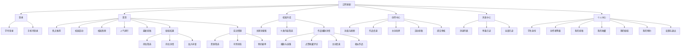

# 《辽传短剧》功能结构图

```mermaid
flowchart TD
    A["辽传短剧"] --> B["登录"]
    A --> C["首页"]
    A --> D["校园片库"]
    A --> E["创作中心"]
    A --> F["消息中心"]
    A --> G["个人中心"]

    B --> B1["学号登录"]
    B --> B2["手机号登录"]

    C --> C1["焦点推荐"]
    C --> C2["校园活动"]
    C --> C3["校园热映"]
    C --> C4["人气排行"]
    C --> C5["最新投稿"]
    C --> C6["剧组招募"]
    C --> C7["实训资源"]

    D --> D1["关键词搜索"]
    D --> D2["8 类内容筛选"]
    D --> D3["作品播放详情"]
    D3 --> D31["播放与选集"]
    D3 --> D32["点赞收藏评论"]
    D3 --> D33["主创信息"]
    D3 --> D34["相似作品"]

    E --> E1["封面与视频"]
    E --> E2["作品信息"]
    E --> E3["主创名单"]
    E --> E4["活动投稿"]
    E --> E5["提交审核"]

    C6 --> H1["岗位筛选"]
    C6 --> H2["岗位详情"]
    C6 --> H3["加入申请"]

    C7 --> I1["资源筛选"]
    C7 --> I2["可用状态"]
    C7 --> I3["预约表单"]

    F --> F1["消息列表"]
    F --> F2["单条已读"]
    F --> F3["全部已读"]

    G --> G1["学生身份"]
    G --> G2["创作者等级"]
    G --> G3["我的投稿"]
    G --> G4["我的收藏"]
    G --> G5["我的剧组"]
    G --> G6["我的预约"]
    G --> G7["设置与退出"]
```

## 页面层级

1. 一级导航：首页、片库、创作、消息、我的。
2. 二级业务页：播放详情、剧组招募、实训资源。
3. 弹层详情：活动、岗位、预约、主创、分享、消息与个人记录。
